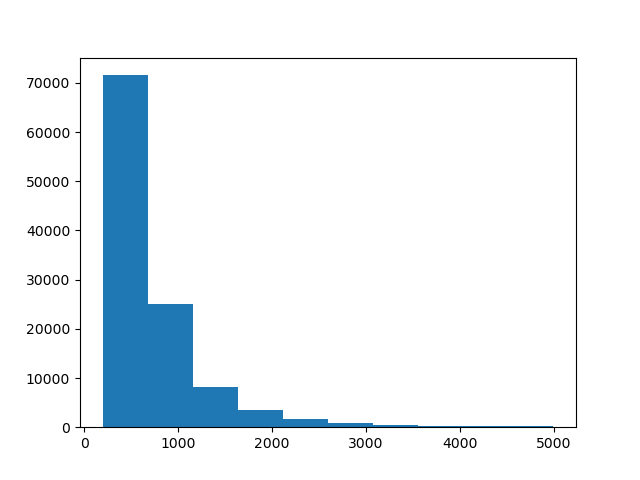
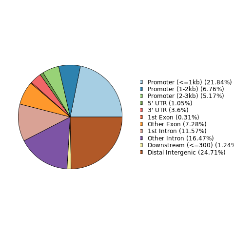
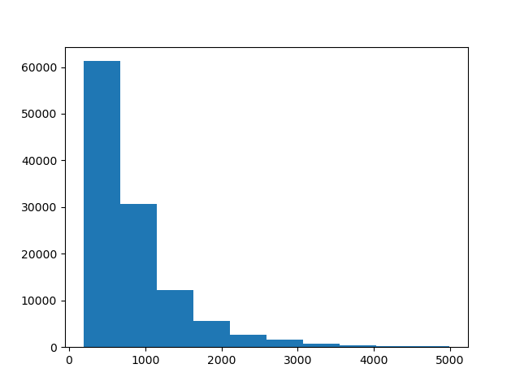
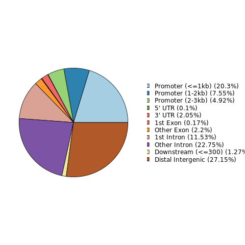
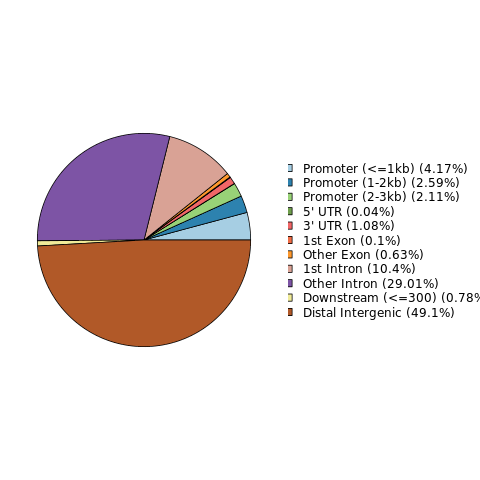
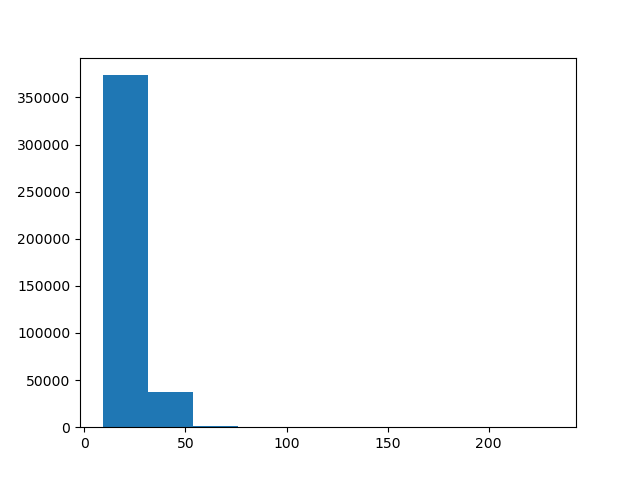
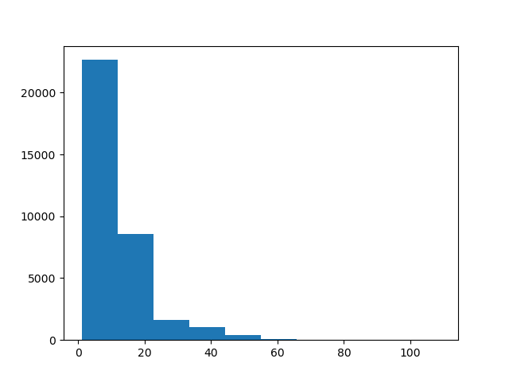
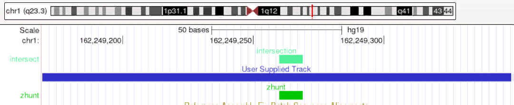

## Длины и положение пиков

## 

## Известное расположение вторичной структуры ДНК (zhunt)

## Пересечения

`cat  *.hg19.filtered.bed  |   sort -k1,1 -k2,2n   |   bedtools merge   >  H3K4me1_K562.merge.hg19.bed`

`[filter with src/filter.py]`

`bedtools intersect -a zhunt.bed -b H3K4me1_K562.merge.hg19.filtered.bed > H3K4me1_K562.intersect.bed`

Пример пересечения: [chr1:162249261-162249269](http://genome-euro.ucsc.edu/cgi-bin/hgTracks?hgsid=265931980_nEsDGHzZ1C2JGNkAszdeuwK63Apa&db=hg19&position=chr1%3A162249261-162249269)

## Анализ

4983 пика ассоциированы с 3403 различными генами. Наиболее значимые категории - связанные с распознаванием запахов (detection of chemical stimulus involved in sensory perception of smell, sensory perception of smell, detection of chemical stimulus involved in sensory perception, sensory perception of chemical stimulus, detection of stimulus involved in sensory perception).